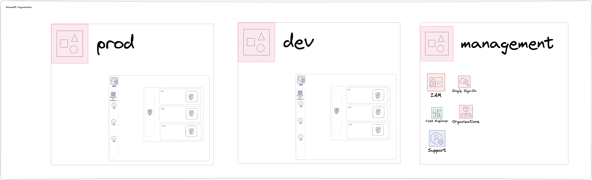

# aws-eks-best-practices-example
An example DevOps setup based on a GitOps flow with strong considerations for security

Show images 

# Prerequistes
* https://aws.amazon.com/cli/
* https://taskfile.dev/installation/

# Deploying infrastructure
1. To get started you'll need to create a AWS account that will be your management account
1. Create an account to use for CICD purposes and log into the CLI
1. Setup organisation and SSO `COMMAND=apply ENV=core/organisation task apply-infrastructure`
1. Create dev EKS cluster `COMMAND=apply ENV=core/dev task apply-infrastructure`
1. Create argocd applications `task create-argocd-applications`
1. Login with the argocd password `task argocd-password`
1. Sync applications

# Helm
Helm charts are hosted at https://github.com/benjefferies/devops-aws-eks-best-practices-example/tree/main/deployments/dev

# Docker
Docker images are build by github actions and deployed to and hosted in github packages https://github.com/benjefferies?tab=packages&repo_name=devops-aws-eks-best-practices-example